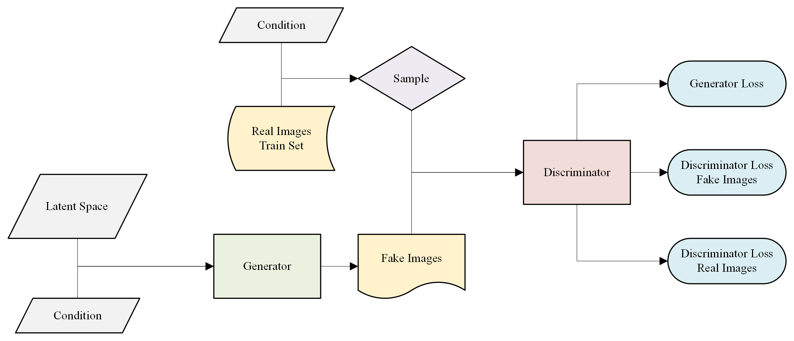
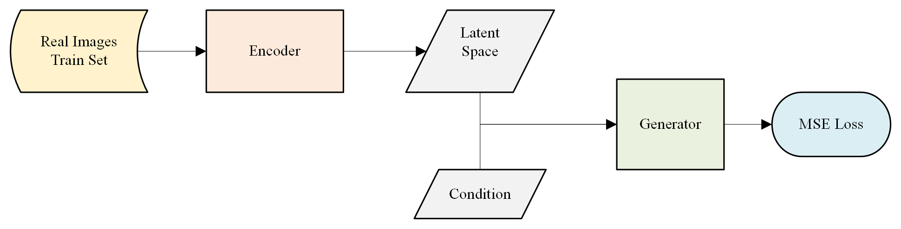
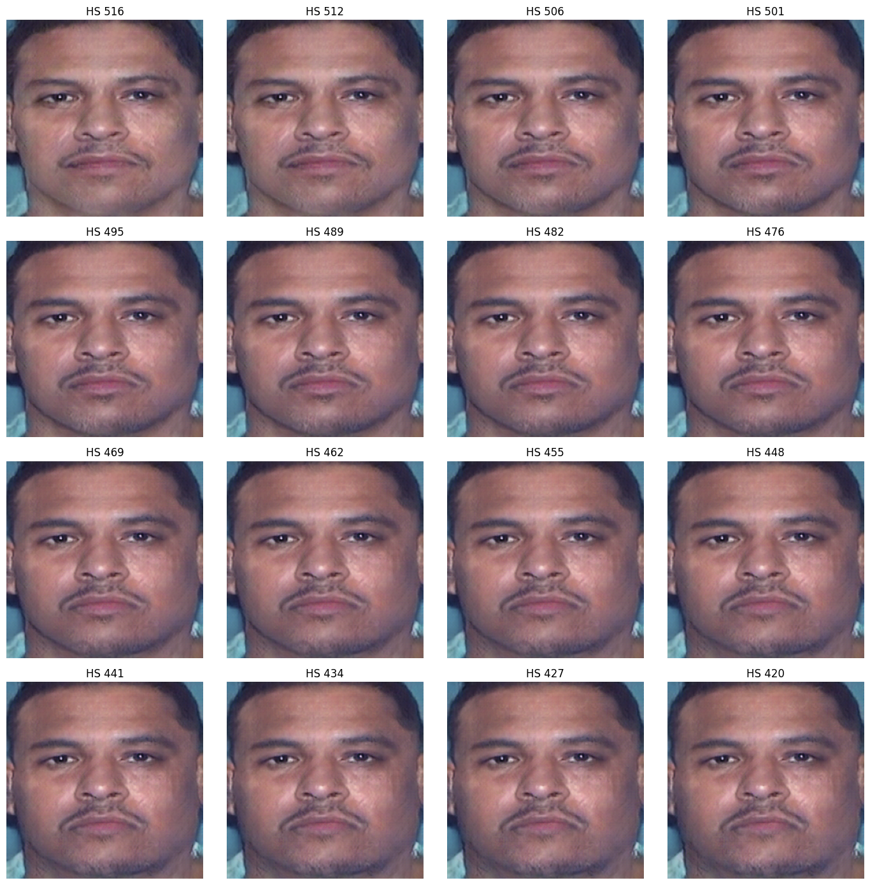

# Face Rescoring based on the dacadoo Health Score

This project is realised as Master Theis at the [Lucerne University of Applied Sciences and Arts](https://www.hslu.ch/de-ch/) in collaboration with [dacadoo ag](https://www.dacadoo.com). The aim of this project is to build a Conditional Generative model which is able to manipulate a person's face based on a change in health. As an approsimation of health, this projects uses the BMI and the dacadoo Health Score. 

Therefore, a cGAN as well as an Encoder were implemented from scratch using TensorFlow2. An overview of the setup is shown in the two figures below. The models were trained using the premium GPU in a high-RAM runtime environment Google Coalb based on the [Illinois DOC Labeled Faces Dataset](https://www.kaggle.com/datasets/davidjfisher/illinois-doc-labeled-faces-dataset). The project introduced three different model with differnt resoltions and variables as conditions:

* BMI - 64 x 64 resolution (proof of concept)
* BMI - 256 x 256 resolution
* HS - 256 x 256 resolution

## Results

An example of face rescoring is shown below. Thereby, the condition supplied to the generator is adaped to achive the facial attribute manipulation.

## Folder Structure

The first folder contains three Jupyter Notebooks covering the data preparation and analyis.

* Data Cleaning and Preparation: This notebook focuses on preparing the dataset for analysis by cleaning and organizing the data. It also involves calculating additional parameters to supplement the dataset.
* Face Cropping: This notebook deals with the detection and cropping of faces from the original images in the dataset.
* Data Analysis: This notebook performs a statistical analysis of the dataset to gain insights and draw conclusions.

The second folder contains three sub-directories (one for each model) which contain the nessecary scripts to train and evaluate the models. 
## Built With

* Jupyter Notebook
* Python 3.10
* Tensorflow 2.12